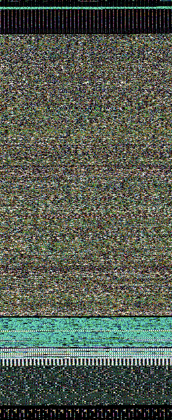
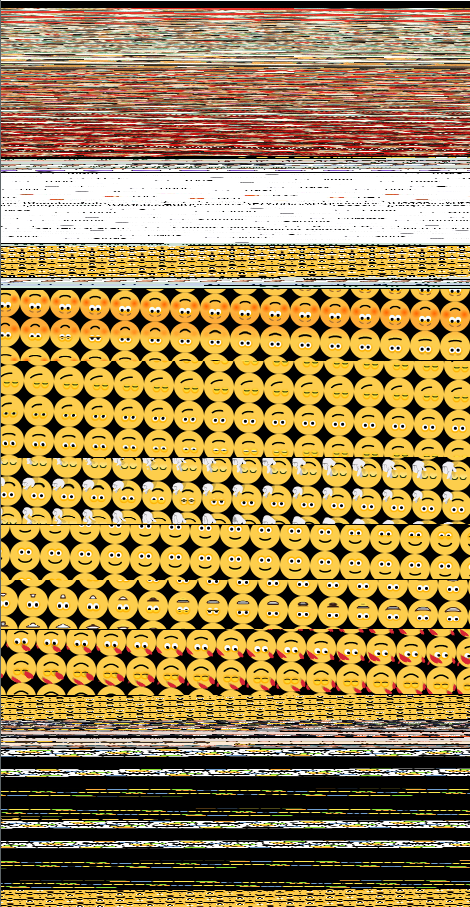
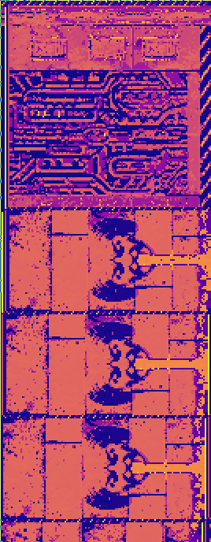
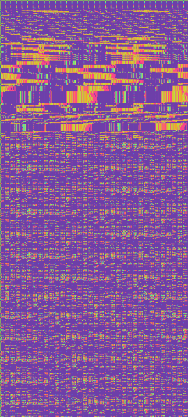
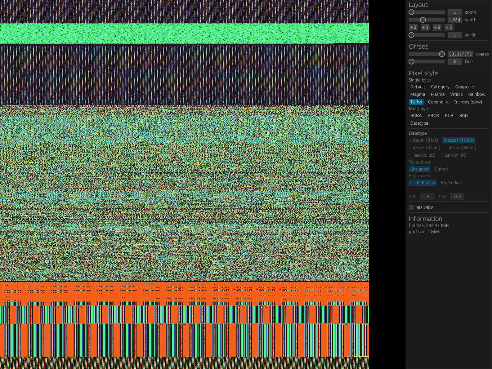

<p align="center">
  
  <br>
  <a href="#examples">Examples</a> • 
  <a href="#how-it-works">How it works</a> • 
  <a href="https://shark.fish/binocle.mp4">Screencast</a> • 
  <a href="#installation">Installation</a>
</p>

*binocle* is a graphical tool to visualize binary data.
It colorizes bytes according to different rules and renders them as pixels in a rectangular grid.
This allows users to identify interesting parts in large files and to reveal image-like regions.

## Examples

| ELF binary | MS Teams memdump | Doom assets | `perf record` samples |
|---|---|---|---|
|  |  |  |  |

## How it works

The program allows you to control various parameters like the *offset* into the file, the *stride*,
the *width* of the rectangular grid as well as the way in which (groups of) bytes are colorized.

<p align="center"></p>

## Preview

[**Watch a short screencast here**](https://shark.fish/binocle.mp4)



## Installation

### On Ubuntu

Download the appropriate `.deb` package from the [Release page](https://github.com/sharkdp/binocle/releases)
and install it via `dpkg`:
```
wget https://github.com/sharkdp/binocle/releases/download/v0.1.0/binocle_0.1.0_amd64.deb
sudo dpkg -i binocle_0.1.0_amd64.deb
```

### From binaries (Linux, macOS, Windows)

Download the corresponding archive from the [Release page](https://github.com/sharkdp/binocle/releases).

### With cargo (Linux, macOS, Windows)

binocle can be installed via [cargo](https://doc.rust-lang.org/cargo/):
```
cargo install binocle
```

## License

binocle is dual-licensed under the terms of the MIT License and the Apache License 2.0.

See the [LICENSE-APACHE](LICENSE-APACHE) and [LICENSE-MIT](LICENSE-MIT) files for details.

## Related work

  - [A Visual Study of Primitive Binary Fragment Types](http://www.rumint.org/gregconti/publications/taxonomy-bh.pdf)
  - [binvis.io](http://binvis.io/)
  - [cantor.dust](https://sites.google.com/site/xxcantorxdustxx/) ([talk](https://www.youtube.com/watch?v=4bM3Gut1hIk))
